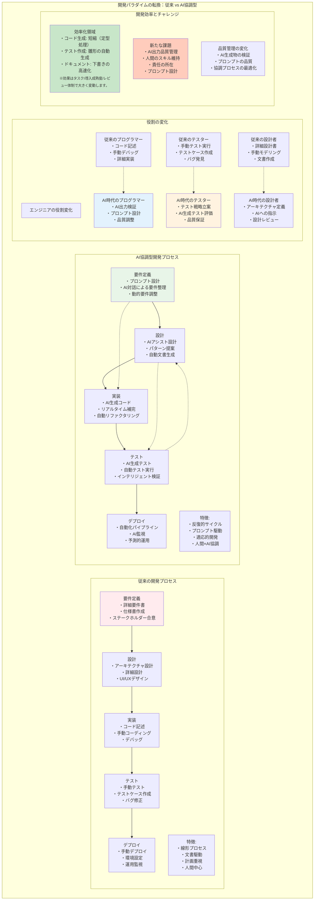

# 第1章 AI主導開発の現状と課題

> **この章の学習目標**
> - AI支援ツールの普及により、開発プロセスやエンジニアの役割がどのように変化しているのかを、従来との比較を通じて説明できるようになること。
> - AI生成コードの効率面だけでなく、品質・責任・スキル維持といった観点で新たに生じるリスクや課題を整理できるようになること。
> - 以降の章で扱うテスト戦略や具体的技法を、「AI主導開発」という前提条件の上に位置づけて考えられるようになること。

## 1.1 開発パラダイムの変化

### 1.1.1 従来の開発プロセスからの転換

ソフトウェア開発は2020年代に入り、根本的な変革期を迎えている。従来の開発プロセスは、要件定義から設計、実装、テスト、デプロイという一連の工程を人間が主体となって進めるものであった。各工程では専門知識を持つエンジニアが、経験と技術力を活かして成果物を作成してきた。

しかし、GitHub Copilot、ChatGPT、Claude等のAI支援ツールの登場により、この前提が大きく変わりつつある。コード生成、設計提案、バグ修正、ドキュメント作成といった開発タスクの多くが、AIとの協調作業によって実行されるようになった。

この変化は単なるツールの進化ではない。開発の主体が「人間中心」から「人間とAIの協調」へとシフトする、パラダイムの転換である。

具体的には、以下の変化が起きている。

**役割の変化**
- プログラマー：コード記述者から、AI出力の検証者・調整者へ
- 設計者：詳細設計から、アーキテクチャ定義とAIへの指示へ
- テスター：手動テスト実行から、テスト戦略立案とAI生成テストの評価へ

**プロセスの変化**
- 線形的な工程から、反復的な生成・検証サイクルへ
- 文書駆動から、プロンプト駆動の開発へ
- 計画重視から、適応的な開発へ

### 1.1.2 AI支援ツールの普及と影響

近年、主要なAI支援開発ツールの導入は急速に進んでいる。導入状況は業界・職種・組織規模で差があるが、個人利用からチーム標準の導入へと広がりつつある。

なお、導入率などの数値は年次で変動するため、本書では「普及が進んでいる」という前提で議論し、個別の割合は断定しない。必要に応じて最新の開発者サーベイ（例: Stack Overflow Developer Survey 2024 など）も参照してほしい。

主要なAI支援は、用途で見ると次のカテゴリに分けられる。
- **コード生成/補完**（実装・リファクタリングの補助）
- **コードレビュー/静的解析支援**（指摘抽出、改善案提示）
- **テスト作成/失敗解析支援**（テスト雛形、原因候補の探索）
- **ドキュメント生成/整理**（下書き、要約、整形）

これらのツールがもたらす影響は多岐にわたる。

**生産性への影響（一般的な傾向）**
- 定型処理（CRUD やボイラープレート）の作成が短縮される
- テストの雛形作成や既存テストの補完が高速化する
- ドキュメントの下書き作成が高速化する

※短縮の度合いはツール/タスク/チームの熟練度/導入方法に強く依存する。本書では、速度向上そのものより「検証・回帰担保がボトルネックになりやすい」点に注目する。

**開発プロセスへの影響**
- プロトタイピングの高速化
- 実装の選択肢の拡大
- 学習曲線の平坦化

**組織への影響**
- ジュニア開発者の即戦力化
- シニア開発者の役割変化
- 新しいスキルセットの必要性

また、本書は「AIが自律的に開発を完結する」前提ではない。AI活用は段階適用（IDE支援 → PR支援 → エージェント）として捉え、エージェント運用は組織要件（セキュリティ/監査/品質ゲート）に応じて限定適用になる場合がある、という前提を置く。

### 1.1.3 開発速度の劇的向上と品質課題

AI支援により開発速度は飛躍的に向上した。MVPの開発期間が数ヶ月から数週間に短縮される事例も珍しくない。しかし、この速度向上は新たな品質課題を生み出している。

**速度向上の実態（例）**
- 初期実装：数倍程度の高速化
- 機能追加：繰り返し作業の高速化
- バグ修正：原因候補の探索が高速化

※ここでの表現は目安であり、プロジェクト特性や導入成熟度により変動する。

**顕在化した品質課題**
1. **技術的負債の蓄積加速**
   - AI生成コードの重複・冗長性
   - アーキテクチャの一貫性欠如
   - 保守性を考慮しない実装

2. **暗黙的な品質低下**
   - エラーハンドリングの不備
   - セキュリティ考慮の欠落
   - パフォーマンス最適化の不足

3. **検証の困難性**
   - 生成コードの理解不足
   - テストケースの不完全性
   - 品質基準の曖昧化

## 1.2 品質保証の新たな課題

### 1.2.1 AI生成コードの信頼性問題

AI生成コードの信頼性は、従来の人間が書いたコードとは異なる観点から評価する必要がある。AIは学習データに基づいてコードを生成するため、以下の特有の問題が存在する。

**パターン依存の問題**
- 一般的なパターンへの過度な依存
- エッジケースの考慮不足
- 文脈理解の限界による不適切な実装

**一貫性の問題**
- 同一プロンプトでも出力が変動
- コーディング規約の不統一
- 命名規則の揺らぎ

**セキュリティの問題**
- 脆弱なコードパターンの再現
- 入力検証の不完全性
- 認証・認可の実装漏れ

これらの問題に対処するため、新しい信頼性評価フレームワークが必要となる。

1. **静的解析の強化**
   - AI特有のアンチパターン検出
   - セキュリティ脆弱性の自動スキャン
   - コード品質メトリクスの再定義

2. **動的検証の拡充**
   - Property-based Testingの活用
   - Fuzz Testingの適用範囲拡大
   - 実行時監視の強化

### 1.2.2 テスト網羅性の再定義

従来のテスト網羅性は、コードカバレッジを中心に評価されてきた。しかし、AI生成コードに対しては、この指標だけでは不十分である。

**従来の網羅性指標の限界**
- 行カバレッジ：生成コードの冗長性により形骸化
- 分岐カバレッジ：AIが生成する複雑な条件式への対応不足
- 関数カバレッジ：細分化された関数群の意味的網羅性欠如

**新しい網羅性の概念**
1. **意味的網羅性**
   - ビジネスロジックの網羅
   - ユースケースシナリオの完全性
   - エラーシナリオの包括性

2. **データ網羅性**
   - 入力値空間の探索
   - 境界値・異常値の体系的テスト
   - 組み合わせパターンの網羅

3. **非機能要件の網羅性**
   - パフォーマンスシナリオ
   - セキュリティ脅威モデル
   - 可用性・信頼性要件

### 1.2.3 責任所在の曖昧化

AI生成コードにおける最も複雑な課題の一つが、責任所在の明確化である。バグや障害が発生した際、その原因と責任を特定することが困難になっている。

**責任の多層構造**
- AI提供者：モデルの品質責任
- ツール提供者：統合・UI/UXの責任
- 開発者：プロンプト作成と検証責任
- 組織：採用判断と品質管理責任

**法的・倫理的課題**
1. **契約上の責任**
   - SLAの定義困難性
   - 保証範囲の明確化
   - 免責事項の妥当性

2. **品質保証の責任**
   - レビュープロセスの必要十分性
   - テスト完全性の立証
   - 継続的監視の実施

3. **インシデント対応**
   - 原因究明の複雑化
   - 改善措置の実効性
   - 再発防止の困難性

## 1.3 本書の目的とアプローチ

### 1.3.1 想定読者と前提知識

本書は、AI主導開発時代において品質保証に携わる全ての技術者を対象としている。

**主要な想定読者**
1. **品質保証エンジニア**
   - 現在のテスト手法に限界を感じている
   - AI時代の新しい品質保証手法を学びたい
   - キャリアの方向性を模索している

2. **開発マネージャー・テックリード**
   - チームの品質戦略を立案する立場
   - AI導入による品質影響を理解したい
   - 組織変革を推進する責任がある

3. **ソフトウェアエンジニア**
   - AI支援ツールを日常的に使用
   - 生成コードの品質に関心がある
   - 品質保証スキルを身につけたい

**前提知識**
- ソフトウェア開発の基本的な工程理解
- プログラミング経験（言語は問わない）
- 基本的なテスト概念（単体テスト等）の理解
- AI・機械学習の詳細知識は不要

### 1.3.2 本書の構成と読み方

本書は4部構成で、段階的に理解を深められるよう設計されている。

**第1部：基礎編（第1〜3章）**
- AI主導開発の現状理解
- テストの基礎知識の確認
- AIコードの特性把握

**第2部：戦略編（第4〜6章）**
- 新しいテスト戦略の構築
- 実践的な検証技法
- 自動化とAIの協調

**第3部：実践編（第7〜9章）**
- メトリクスと評価手法
- 組織・プロセス変革
- 具体的なケーススタディ

**第4部：発展編（第10〜11章）**
- 高度なトピックの探求
- 将来展望と準備

**推奨される読み方**
- 初級者：第1部から順番に読み進める
- 中級者：第2部から始め、必要に応じて第1部を参照
- 上級者：関心のある章から読み始め、全体を俯瞰

### 1.3.3 実践的活用のためのガイド

本書を最大限活用するための指針を示す。

**個人での活用**
1. **スキル評価チェックリスト**
   - 各章末の理解度確認
   - 実践課題への取り組み
   - 習得スキルの記録

2. **実務への適用**
   - 小規模プロジェクトでの試行
   - 既存プロセスへの段階的統合
   - 効果測定と改善

**チーム・組織での活用**
1. **勉強会・読書会**
   - 章単位での議論
   - 事例共有とディスカッション
   - アクションアイテムの設定

2. **プロセス改善**
   - 現状評価（As-Is分析）
   - 目標設定（To-Be定義）
   - 移行計画の策定

3. **人材育成**
   - スキルマップの作成
   - 教育プログラムの設計
   - メンタリング体制の構築

**継続的な学習**
- オンラインリソースの活用
- コミュニティへの参加
- 最新動向のキャッチアップ

本書は、AI主導開発時代における品質保証の羅針盤となることを目指している。技術の進化は速いが、本書で示す原則と手法は、読者が変化に適応し続けるための基礎となるはずである。
